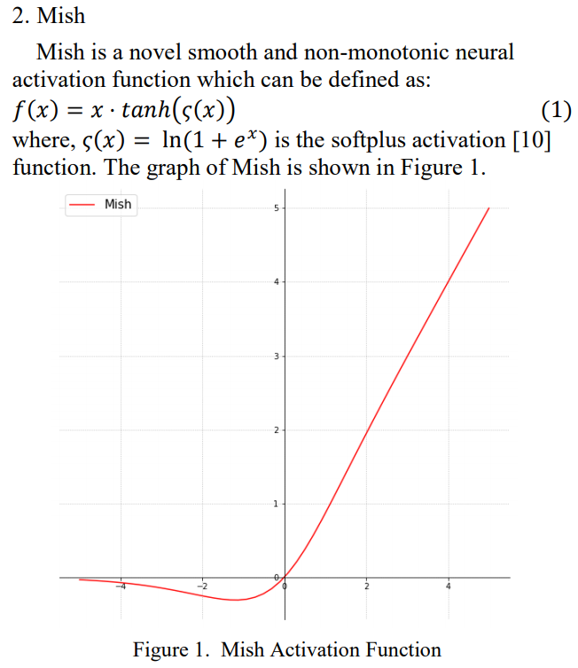
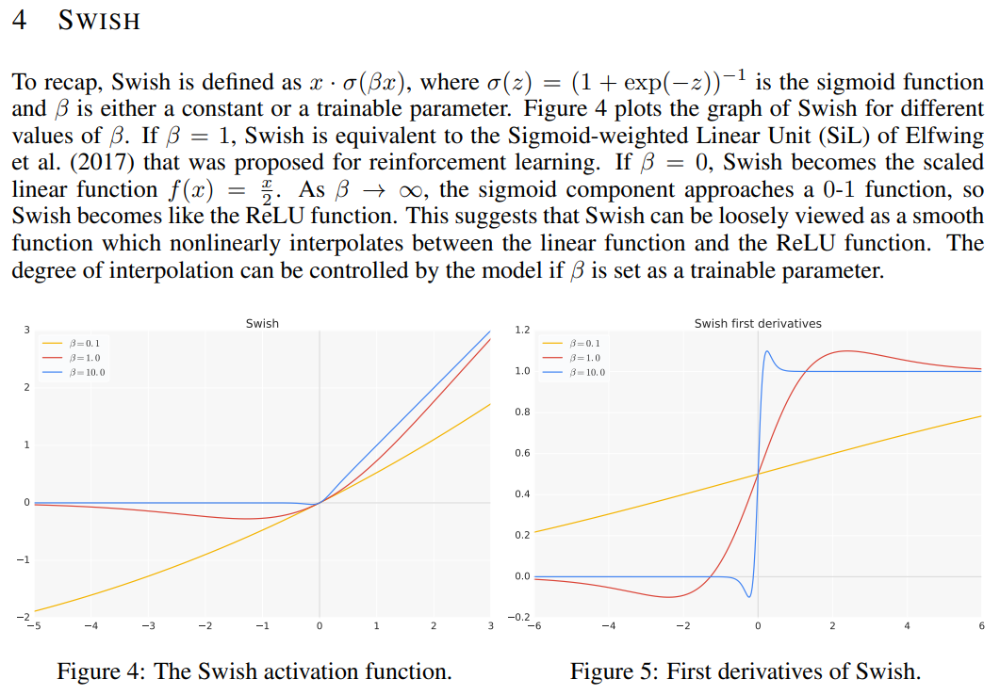
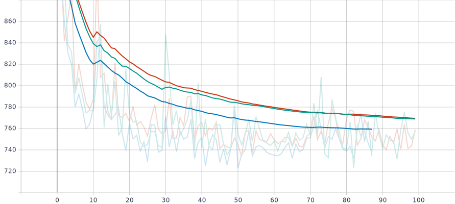

# Memory efficient implementation of SWISH and MISH

- [x] Swish from [this paper](https://arxiv.org/abs/1710.05941)
- [x] Mish from [this paper](https://arxiv.org/pdf/1908.08681.pdf)


## Mish


## Swish 


## Implementations
These two activation functions are implemented using the Pytorch custom Function. 
This implementation can save around 20% memory usage.

i.e: 

This Swish implementation: 1816 MB 
Simple swish implementation: 2072 MB

This Mish implementation: 1816 MB
Simple Mish implementation: 2328 MB


## Usage
Usage: similar to torch.nn.ReLU()...and torch.autograd.Function 
```
from swish import Swish
from mish import Mish
self.conv1 = nn.Sequential(
                            nn.Linear(256, width),
                            Swish(),
                            nn.BatchNorm1d(width),
                            nn.Linear(width, 1)
                          )

self.conv2 = nn.Sequential(
                            nn.Linear(256, width),
                            Mish(),
                            nn.BatchNorm1d(width),
                            nn.Linear(width, 1)
                          )
```

## Performance
More details on the comparison between these two activation functions can be found from their papers. 

From my experiments on mono depth estimation, both of these perform on par or better then ReLU6. Mish performs slightly better then Swish and ReLU6. 



